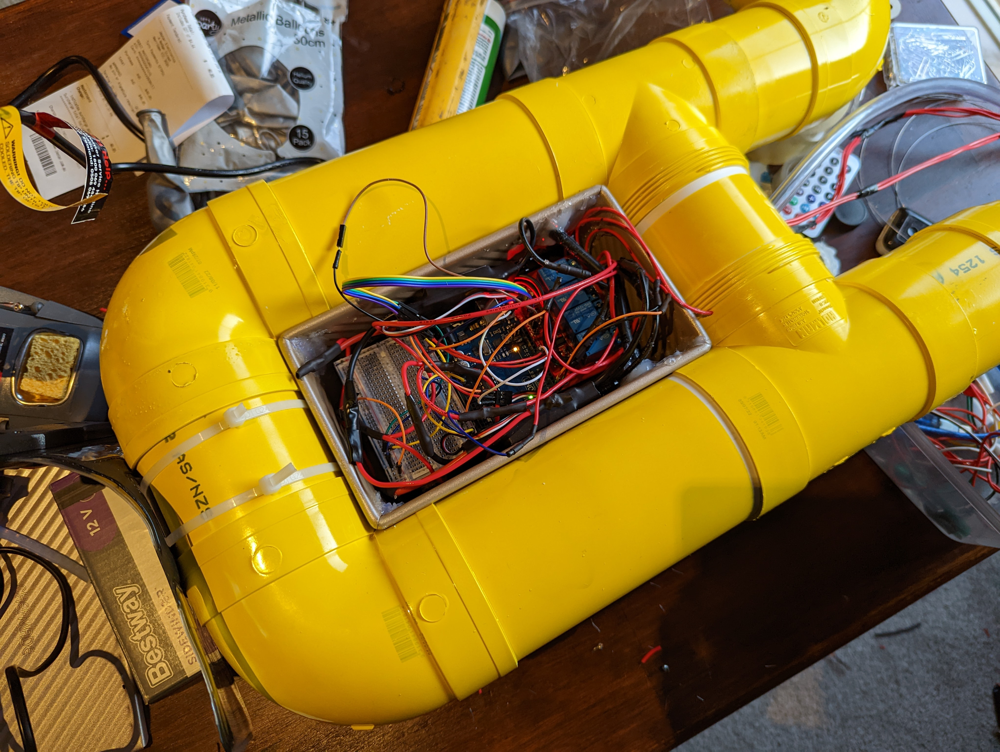

<!-- PROJECT SHIELDS -->
<!--
*** I'm using markdown "reference style" links for readability.
*** Reference links are enclosed in brackets [ ] instead of parentheses ( ).
*** See the bottom of this document for the declaration of the reference variables
*** for contributors-url, forks-url, etc. This is an optional, concise syntax you may use.
*** https://www.markdownguide.org/basic-syntax/#reference-style-links
-->

<!-- PROJECT LOGO -->
 

    <h3 align="center">Custom Submarine Android Controller</h3>

<!-- ABOUT THE PROJECT -->
## About The Project

This is the codebase, including Arduino code and a complementary Android remote controller app for a custom built submarine project

### Built With

Android Studio

<!-- GETTING STARTED -->
## Getting Started

To get a local copy up and running follow these simple steps.

### Prerequisites

Android Studio
Arduino IDE

### Installation

Load the Arduino code (submarine_ard_code.ino) onto the Arduino using any Arduino IDE, then simply import controller project using Android Studio and build

<!-- USAGE EXAMPLES -->
## Usage
 
[Here](in_action.mp4) is a video of the product in action

<!-- CONTACT -->
## Contact

Mingxuan Fu - frankfumel@gmail.com

<!-- ACKNOWLEDGEMENTS -->
## Acknowledgements

The controller app is created with help from the following guide by Chee Yi Ong  
https://punchthrough.com/android-ble-guide/

